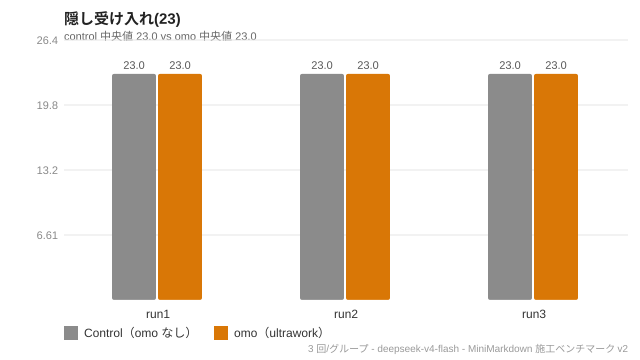
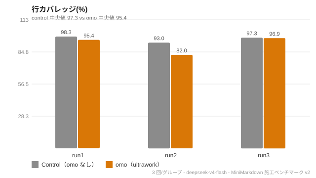
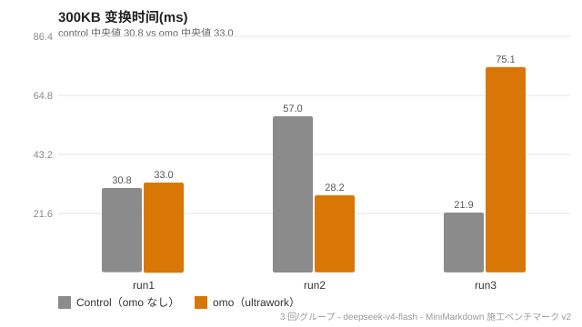
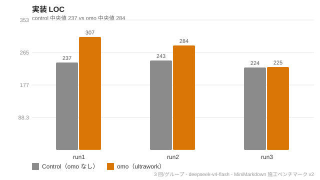
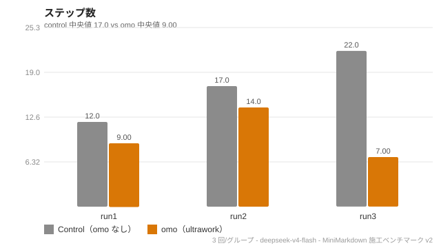
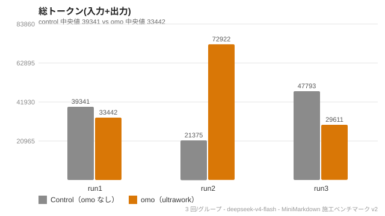
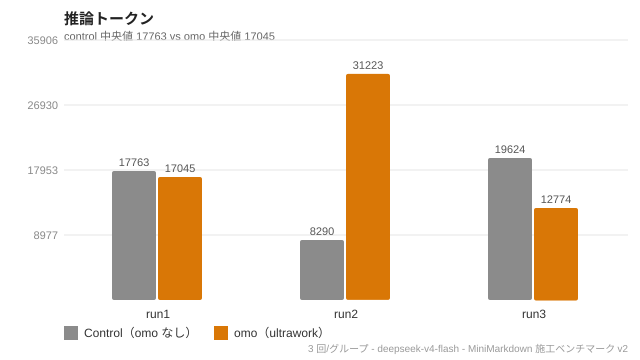
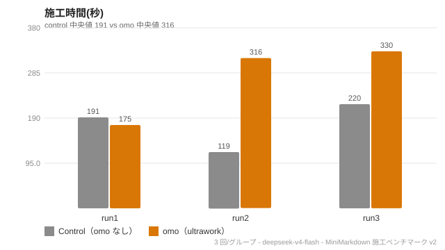
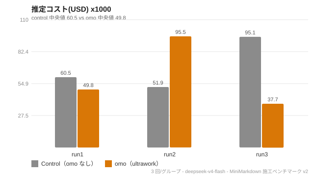

<div align="center">

# omo-deepseek-harness

**oh-my-openagent（OMO）のディシプリン・エージェント編成を DeepSeek Harness へ。**

[简体中文](README.md) · [English](README.en.md) · [日本語](README.ja.md)

</div>

## これは何？

`omo-deepseek-harness` は [oh-my-openagent](https://github.com/code-yeongyu/oh-my-openagent)（OMO）の **ディシプリン・エージェント + マルチモデルルーティング + ultrawork** という哲学を [DeepSeek Harness](https://github.com/deepseek-ai/deepseek-harness)（DSH）に運ぶ、軽量で独立実装されたアダプタです（**CC0-1.0** パブリックドメイン）。

`ultrawork` と入力するだけで、Sisyphus が編成を開始します：意図解析 → コードベース評価 → カテゴリ別委任 → 独立検証。完了するまで止まりません。

## 特徴

- **一言トリガー** — `ultrawork`（または `ulw`）と入力するだけで、Sisyphus がタスクを完了まで推進します。
- **ディシプリン・エージェント委任** — プリ登録されたロール・サブエージェント（`subagent_hephaestus` / `subagent_explore` / `subagent_oracle`）を DSH ネイティブの `tool-subagent` 上で利用。
- **ultrawork 4 フェーズプロトコル** — 意図ゲート → コードベース評価 → カテゴリ別スマート委任 → 独立検証。
- **完了まで止まらない契約** — `tool-todo` / `tool-goal` による Todo 永続化で再開；中断後もチェックポイントから続行。
- **エンジンの再発明なし** — DSH のネイティブ機能の上に載せる薄いアダプタであり、新しいオーケストレーションランタイムではありません。

## 帰属（Attribution）

[oh-my-openagent](https://github.com/code-yeongyu/oh-my-openagent)（作者 [code-yeongyu](https://github.com/code-yeongyu)、**SUL** ライセンス）に着想を得ています。

- 本プロジェクトは OMO のソースコードを**一切使用していません**。アーキテクチャの*理念*（ディシプリン・エージェント / カテゴリルーティング / ultrawork プロトコル）をゼロから再実装しています。
- エージェント名（Sisyphus、Hephaestus、Prometheus ...）は概念的なオマージュとして使用しています。
- OMO の完全な能力（11 エージェント + 54 hooks + Hashline + Team Mode）が必要な場合はオリジナルを：`bunx oh-my-openagent install`（OpenCode ホストが必要）。

## なぜ OMO をそのまま使わないのか？

**OMO は DeepSeek Harness をネイティブにサポートしていません。** OMO は OpenCode プラグインであり、その中核価値は OpenCode の 54+ ライフサイクルフック、ツール呼び出しチャネル、セッション/ToDo 永続化に依存しています——DSH には等価物がありません。OMO をそのまま移植するのは実質リライトであり、SUL + CLA の制約も受けます。

本プロジェクトは「頭脳」（エージェント定義 + カテゴリルーティング + ultrawork プロトコル）だけをプラットフォーム非依存の `core/` に抽出し、DSH のネイティブ能力（`tool-subagent` / `tool-todo` / `tool-goal` ...）にマッピングする薄いアダプタを加えたものです——**エンジンの再発明はしません**。

## アーキテクチャ

```
omo-deepseek-harness/
├── core/                  # プラットフォーム非依存の「頭脳」
│   ├── agents.yaml        # 11 ディシプリン・エージェント（role / category / needs_tools / desc）
│   ├── categories.yaml    # タスクカテゴリ → モデル能力要件
│   ├── prompts/           # エージェントシステムプロンプト（{{platform_tools}} プレースホルダ）
│   └── ultrawork.md       # ultrawork プロトコル：4 フェーズ + ToDo 継続 + 完了まで止まらない
├── adapters/dsh/          # DeepSeek Harness アダプタ（薄層）
│   ├── ultrawork-trigger.md      # クイックエントリ：DSH セッションに貼り付けて Sisyphus を起動
│   ├── AGENTS.md                 # Sisyphus プロンプト：~/.dsh/AGENTS.md にコピー（ホットリロード）
│   ├── category-model-map.yaml   # category → deepseek-v4-flash ルーティング
│   └── cordis.patch.yml          # 任意：OMO ロール・サブエージェントツール（スキーマ校正済み）
└── docs/architecture.md   # 設計判断 + OMO 機能デグラデーションマップ
```

## ベンチマーク · Benchmarks

**DeepSeek Harness** 上で行った統制実験：同一のソフトウェア設計仕様書（Markdown→HTML 変換器）を control（omo なし）と omo（ultrawork 4 フェーズ）の 2 グループのエージェントが各々施工。成否は親エージェントが**独立に実行する隠し受け入れスイート + カバレッジ + 性能実測**で判定（サブエージェントの自己申告ではありません）。モデル `deepseek-v4-flash`、各グループ 3 回実行。

### 中位値での比較

| 項目 | control | omo | 差 |
|---|---|---|---|
| **成果物 · 隠し受け入れ (23)** | 23/23 ✅ | 23/23 ✅ | 差なし |
| **成果物 · 行カバレッジ** | 97.3% | 95.4% | −1.9pp |
| **成果物 · 300KB 処理** | 30.8ms | 33.0ms | ほぼ同等 |
| 成果物 · 実装 LOC | 237 | 284 | +20% |
| **プロセス · 施工ステップ** | 17 | 9 | **−47%** |
| **プロセス · 推定コスト** | $0.060 | $0.050 | **−18%** |
| **プロセス · 施工時間** | 191s | 316s | **+65%** |
| プロセス · 総/推論トークン | 39.3k / 17.8k | 33.4k / 17.0k | ほぼ同等 |

### チャート











### 結論

- **成果物の品質は両グループで差なし**：どちらも仕様準拠で **23/23（XSS エスケープ 4 項目含む）** を通過するソフトウェアを納品——仕様が明確なら、omo の有無は最終ソフトウェアの正しさに影響しません。
- **omo の価値はプロセスに表れます**：**ステップ −47%、推定コスト −18%**（計画先行 ⇒ 行き当たりばったりの手戻り小ステップが激減；ステップが少ない ⇒ キャッシュ再読込が少ない）。代償は**施工時間 +65%**（1 ステップあたりの計画/検証が増える）、トークンはほぼ同等。
- **複雑度の転換点**：単純タスク（v1）では omo は純粋なオーバーヘッド、複雑タスク（v2）では**効率向上**に転じる——「価値はタスクの複雑度とともに高まる」に整合。

### 推奨事項

- **複雑・多段階・手戻りの多い施工タスク** → omo を有効に（計画先行 + 独立検証、実測でステップ減・コスト減）。
- **極めて単純な 1 ステップタスク** → omo を使わず DSH 単体（v1 が純オーバーヘッドと実証）。
- **最短の完了時間を優先** → omo なし；**低コスト + 安定品質 + 規律**を優先 → omo あり。
- omo が強制する**第 4 フェーズの独立検証**は漏れ・幻覚（ハルシネーション）対策の中核であり、複雑な変更では維持すべき。
- 限界：n=3、単一タスク・単一モデル、方向性の結論です。有意性・幅はより大きなサンプルでの再計測が必要。完全データと再現手順は [`docs/benchmark`](docs/benchmark) に。

## クイックスタート（DSH）

前提：DSH インストール済み（`DSH_HOME=~/.dsh`）、デフォルトエージェントモデル `deepseek-v4-flash`、`~/.dsh/cordis.patch.yml` でコアツール（`tool-fs` / `tool-todo` / `tool-subagent` ...）有効。

### インタラクティブ

```bash
dsh    # または dsh-web

# adapters/dsh/ultrawork-trigger.md の内容（--- の間）をセッションに貼り付け、次に：
#   ultrawork build a Node.js hello-world project in ./demo, write tests, run them
```

### Headless（自動化 / CI）

```bash
"$DSH" --profile headless "タスク"
```

## ライセンス

**CC0 1.0 Universal（パブリックドメイン）** — [LICENSE](./LICENSE) 参照。著作権者を主張せず、帰属も不要です。

本プロジェクトは oh-my-openagent のソースコードを含みません。oh-my-openagent の全権利は原作者に帰属し、SUL ライセンスの下で提供されます。