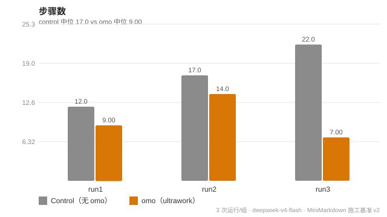
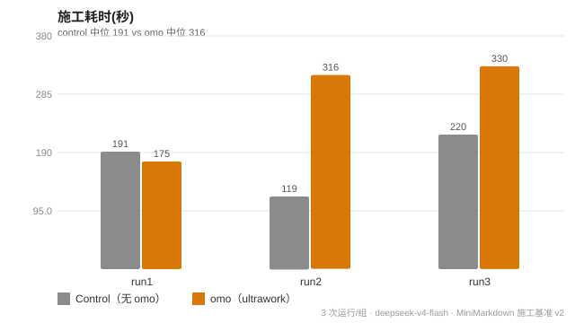
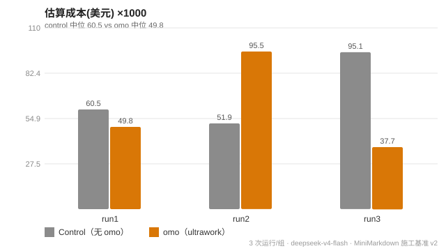

<p align="center">
  
</p>

---

<div align="center">

# omo-deepseek-harness

**把 oh-my-openagent（OMO）的纪律型 Agent 编排带到 DeepSeek Harness。**

[简体中文](README.md) · [English](README.en.md) · [日本語](README.ja.md)

</div>

## 这是什么？

`omo-deepseek-harness` 把 [oh-my-openagent](https://github.com/code-yeongyu/oh-my-openagent)（OMO）的 **纪律型 Agent + 多模型路由 + ultrawork** 理念带到 [DeepSeek Harness](https://github.com/deepseek-ai/deepseek-harness)（DSH）——一个轻量、独立实现的适配层，**CC0-1.0** 公有领域协议。

输入一次 `ultrawork`。Sisyphus 开始编排：解析意图 → 摸清代码库 → 按类别委派 → 独立验证。不完成不停止。

## 特性

- **一词触发** — 输入 `ultrawork`（或 `ulw`），Sisyphus 接管并把任务推进到完成。
- **纪律 Agent 委派** — 预注册角色子代理（`subagent_hephaestus` / `subagent_explore` / `subagent_oracle`），基于 DSH 原生 `tool-subagent`。
- **ultrawork 四阶段协议** — 意图门 → 代码库评估 → 按类别智能委派 → 独立验证。
- **不完成不停止** — 通过 `tool-todo` / `tool-goal` 持久化续跑；中断后从断点继续。
- **不重造引擎** — 薄适配层复用于 DSH 原生能力，而非新编排运行时。

## 致敬声明

受 [oh-my-openagent](https://github.com/code-yeongyu/oh-my-openagent)（作者 [code-yeongyu](https://github.com/code-yeongyu)，**SUL** 协议）启发。

- 本项目**不使用** OMO 的任何源代码，仅从零重实现其架构*理念*（纪律 Agent / 类别路由 / ultrawork 协议）。
- Agent 命名（Sisyphus / Hephaestus / Prometheus ...）作为概念致敬沿用。
- 需要 OMO 完整能力（11 agent + 54 hooks + Hashline + Team Mode）请用原版：`bunx oh-my-openagent install`（需 OpenCode 宿主）。

## 为什么不用 OMO？

**OMO 原生不支持 DeepSeek Harness。** OMO 是 OpenCode 插件，其核心价值依赖 OpenCode 的 54+ 生命周期 hooks、工具调用通道、session/todo 持久化——DSH 均无等价物。原样移植 OMO ≈ 重写，且受 SUL + CLA 约束。

本项目只把「大脑」（Agent 定义 + 类别路由 + ultrawork 协议）抽到平台无关的 `core/`，再加一层薄 adapter 映射到 DSH 原生能力（`tool-subagent` / `tool-todo` / `tool-goal` ...）——**不重造引擎**。

## 架构

```
omo-deepseek-harness/
├── core/                  # 平台无关的「大脑」
│   ├── agents.yaml        # 11 纪律 Agent（role / category / needs_tools / desc）
│   ├── categories.yaml    # 任务类别 → 模型能力要求
│   ├── prompts/           # agent 系统提示词（{{platform_tools}} 占位）
│   └── ultrawork.md       # ultrawork 协议：四阶段 + todo 续跑 + 不完成不停止
├── adapters/dsh/          # DeepSeek Harness 适配层（薄层）
│   ├── ultrawork-trigger.md      # 快速入口：粘贴进 DSH 会话即触发 Sisyphus
│   ├── AGENTS.md                 # Sisyphus 提示词：复制为 ~/.dsh/AGENTS.md（热加载生效）
│   ├── category-model-map.yaml   # category → deepseek-v4-flash 路由
│   └── cordis.patch.yml          # 可选：预注册 OMO 角色 subagent 工具（schema 已校准）
└── docs/architecture.md   # 设计决策 + OMO 特性降级映射
```

## 实验基准 · Benchmarks

在 **DeepSeek Harness** 上做的受控实验：同一份软件设计规格书（Markdown→HTML 转换器），由 control（无 omo）与 omo（ultrawork 四阶段）两组 Agent 各自施工。成功与否由父代理**独立执行隐藏验收套件 + 覆盖率 + 性能实测**判定，而非子代理自述。模型 `deepseek-v4-flash`，每组 3 次运行。

> > 每组独立执行 3 次运行（run1–run3），图中每根柱为该 run 的实测值。

### 核心对比（中位数）

| 维度 | control | omo | 差异 |
|---|---|---|---|
| **产物 · 隐藏验收套件 (23)** | 23/23 ✅ | 23/23 ✅ | 无差异 |
| **产物 · 行覆盖率** | 97.3% | 95.4% | −1.9pp |
| **产物 · 300KB 耗时** | 30.8ms | 33.0ms | 持平 |
| 产物 · 实现代码量 | 237 loc | 284 loc | +20% |
| **过程 · 施工步骤** | 17 | 9 | **−47%** |
| **过程 · 估算成本** | $0.060 | $0.050 | **−18%** |
| **过程 · 施工耗时** | 191s | 316s | **+65%** |
| 过程 · 总 token / 推理 token | 39.3k / 17.8k | 33.4k / 17.0k | 持平 |

### 图表





### 结论

- **产物质量两组无差异**：都交付了符合规格、**23/23 通过（含 4 项 XSS 转义安全项）**的软件——规格清晰时，有没有 omo 不影响最终软件的正确性。
- **omo 的价值体现在过程**：**步骤 −47%、估算成本 −18%**（规划先行 ⇒ 零散的返工式小步骤大幅减少；步骤少 ⇒ 缓存重读少）。代价是**耗时 +65%**（每步规划/验证想得更多），token 基本持平。
- **复杂度拐点**：简单任务（v1）omo 是纯开销；复杂任务（v2）omo 转为**效率项**——印证「收益随任务复杂度上升」。

### 建议

- **复杂、多步、易返工的施工任务** → 启用 omo（规划先行 + 独立验证，实测步骤更少、成本更低）。
- **超简单、单步任务** → 不用 omo，直接用 DSH（v1 已证纯开销）。
- **追求最短耗时** → 不用 omo；**追求低成本 + 稳定质量 + 文档纪律** → 启用 omo。
- omo 强制的**第四阶段独立验证**是防遗漏/防幻觉的核心，复杂改动建议保留。
- 局限：n=3、单任务、单模型，属方向性结论；显著性与幅度需更大样本复测。完整数据与复现见 [`docs/benchmark`](docs/benchmark)。

## 快速开始（DSH）

前置：已装 DSH（`DSH_HOME=~/.dsh`），默认 agent 模型 `deepseek-v4-flash`，`~/.dsh/cordis.patch.yml` 已启用核心工具（`tool-fs` / `tool-todo` / `tool-subagent` ...）。

### 交互式

```bash
dsh    # 或 dsh-web

# 把 adapters/dsh/ultrawork-trigger.md 的内容（--- 之间）粘贴进会话，然后说：
#   ultrawork 在 ./demo 建一个 Node.js hello-world 项目，写测试，跑通自检
```

### Headless（自动化 / CI）

```bash
"$DSH" --profile headless "你的任务"
```

## License

**CC0 1.0 Universal（公有领域）** — 见 [LICENSE](./LICENSE)。不声明任何版权人，不要求署名。

本项目不含 oh-my-openagent 的任何源代码。oh-my-openagent 的全部权利归原作者所有，SUL 协议。