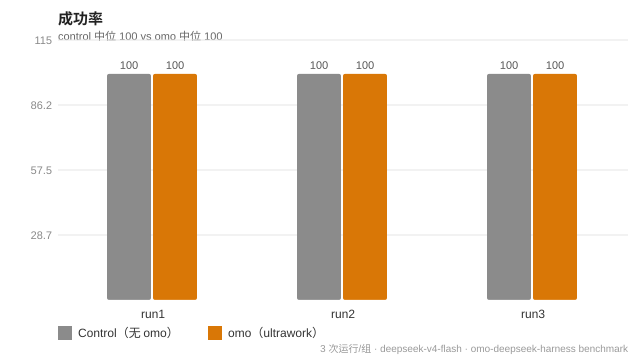
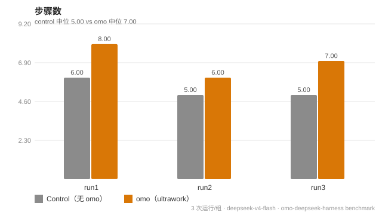
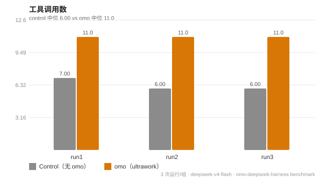
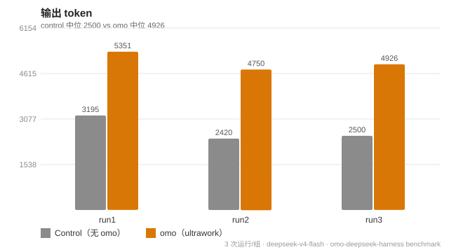
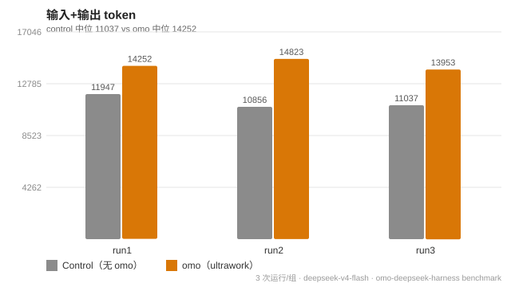
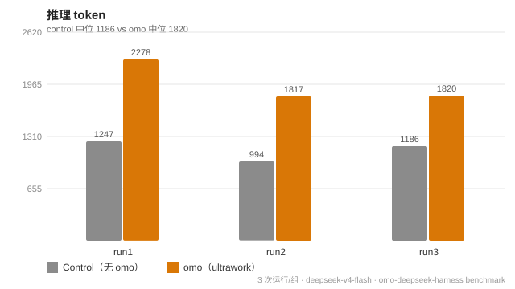
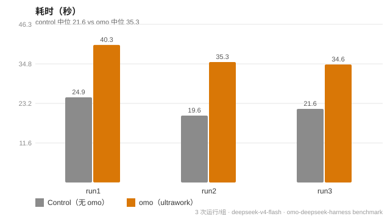
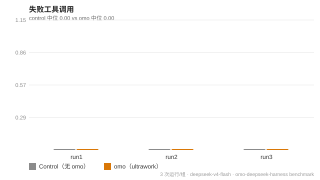

# omo-deepseek-harness Benchmark

- **[v2（推荐阅读）](./v2/README.md)** — 同一软件设计方案施工对照（MiniMarkdown 转换器），对产物用成熟基准评估（隐藏验收套件 / 覆盖率 / 性能 / 成本受控）。**v1 因任务过于简单、成功率饱和而无法区分，v2 为有效实验。**
- [v1（历史）](./README.md) — 简单玩具任务对照（成功率饱和，仅作存档）。

## v1 原始实验（存档）

**日期**：2026-08-20 · **模型**：deepseek-v4-flash（provider deepseek-official）· **每组 3 次运行** · **任务成功与否由父代理独立重跑验证（非子代理自述）**

## 1. 实验设计

**目的**：衡量 omo 插件（ultrawork/Sisyphus 编排协议）对**同一个任务**的增量效果——同任务、同模型、同工作区，仅差一个变量：是否注入 ultrawork 编排协议。

| 维度 | 设计 |
|---|---|
| 任务 | 在独立目录创建 Node.js 项目：实现 `sumUniqueFlatten`（扁平化+去重+求和），写 ≥4 个 `node:test` 用例，`npm test` 跑到全绿 |
| 对照组（control） | 子代理收到任务 + 通用编码指令，无 omo 协议 |
| 处理组（omo） | 子代理收到同一任务 + ultrawork 四阶段协议（Sisyphus：意图门→代码库评估→智能委派→独立验证） |
| 运行数 | 每组 3 次（control-1..3 / omo-1..3），独立目录隔离 |
| 成功判定 | 父代理**独立重跑** `node --test`，退出码 0 + 产物齐全（非子代理报告） |

**指标基准（arXiv 科研参考）**：
- **AI Agents That Matter（arXiv 2407.01502）**：成本受控评估——同时报告能力（成功率）与成本（token/时长/估算费用），同预算下比较效率
- **SWE-bench（arXiv 2310.06770）**：任务级成功率 + 产物完整性（文件/测试验收）
- **Reflexion（arXiv 2303.11366）**：自纠循环——失败工具调用、重试次数、验证行为

## 2. 原始数据（从会话日志 JSONL 提取，含真实 token usage）

| 运行 | 步骤 | 工具调用 | 失败调用 | 输入 token | 输出 token | 缓存读取 k | 推理 token | 耗时 s | 成功 |
|---|---|---|---|---|---|---|---|---|---|
| control-1 | 6 | 7 | 0 | 8752 | 3195 | 92.9 | 1247 | 24.9 | ✅ |
| control-2 | 5 | 6 | 0 | 8436 | 2420 | 73.5 | 994 | 19.6 | ✅ |
| control-3 | 5 | 6 | 0 | 8537 | 2500 | 74.0 | 1186 | 21.6 | ✅ |
| **control 中位** | **5** | **6** | **0** | **8537** | **2500** | **74.0** | **1186** | **21.6** | **3/3** |
| omo-1 | 8 | 11 | 0 | 8901 | 5351 | 137.2 | 2278 | 40.3 | ✅ |
| omo-2 | 6 | 11 | 0 | 10073 | 4750 | 97.8 | 1817 | 35.3 | ✅ |
| omo-3 | 7 | 11 | 0 | 9027 | 4926 | 115.8 | 1820 | 34.6 | ✅ |
| **omo 中位** | **7** | **11** | **0** | **9027** | **4926** | **115.8** | **1820** | **35.3** | **3/3** |

**成本估算**（按 DeepSeek 公开参考价，显式假设：输入 miss $0.27/M、缓存 $0.07/M、输出 $1.10/M；v4-flash 实际定价未公开，此为估算）：

| 运行 | 估算成本 |
|---|---|
| control-1 / -2 / -3 | $0.0124 / $0.0101 / $0.0102（中位 ~$0.0102） |
| omo-1 / -2 / -3 | $0.0179 / $0.0148 / $0.0160（中位 ~$0.0160） |

## 3. 图表

## 4. 结论（诚实报告）

1. **成功率无差异**：两组均为 3/3（100%）——本任务对两个条件都过于简单（单文件、单函数、无外部依赖），无法在成功率维度区分增量效果。
2. **omo 的 ultrawork 协议带来显著开销**（中位对比）：
   - 步骤 **+40%**（5 → 7）、工具调用 **+83%**（6 → 11）
   - 输出 token **~2 倍**（2500 → 4926）、推理 token **+53%**（1186 → 1820）
   - 耗时 **+63%**（21.6s → 35.3s）、估算成本 **~+56%**（$0.0102 → $0.0160）
   - 失败工具调用两组均为 0（无自纠需求）
3. **开销来源可解释**：omo 组实际执行了四阶段协议——todo 意图记录、动手前代码库评估、独立验证阶段重跑测试并输出结构化报告；这些"纪律文本"直接体现在输出/推理 token 翻倍上。对照组直接实现+测试，无此开销。
4. **价值面未覆盖（诚实局限）**：
   - 本任务**无法体现 omo 的收益面**（多步任务委派、跨轮续跑、复杂改动防遗漏、独立验证防幻觉）——这些收益需要更大规模、多步骤、易出错的任务才能测出，本基准的任务规模不足以触发。
   - 本轮 omo 组**未使用预注册角色 subagent 工具**（`subagent_*` 需 dsh 重启后挂载），只测试了协议层（提示词驱动）效果，未测角色委派层。
   - 结论外推受限：n=3，单任务，单模型。
5. **一句话总结**：在简单单步任务上，ultrawork 编排不改变成功率、成本约 +56%；其设计意图是复杂多步任务下的纪律性（规划、续跑、独立验证），收益应在更难的任务上另行测量。

## 5. 复现

- 任务与双条件 prompt：见本目录 `prompt-control.txt` / `prompt-omo.txt`
- 原始指标：`data.json`（从会话 JSONL 提取，含 token usage）
- 运行产物（本地证据）：`H:\Code\omo-bench\{control|omo}-{1..3}\`（父代理独立重跑 `node --test` 验证，6/6 退出码 0）
