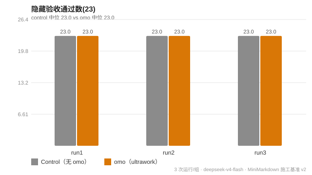
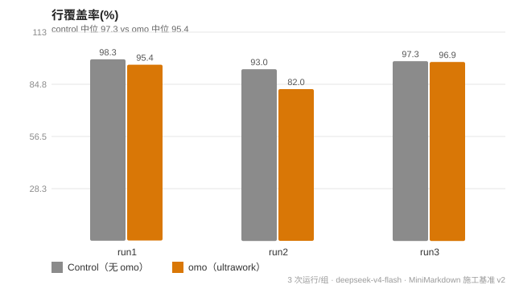
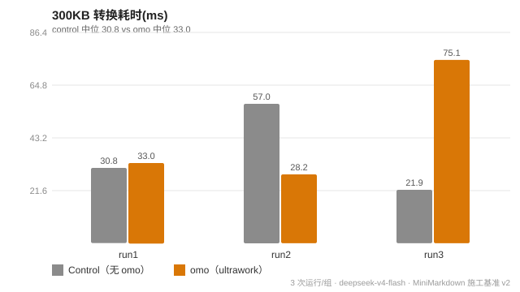
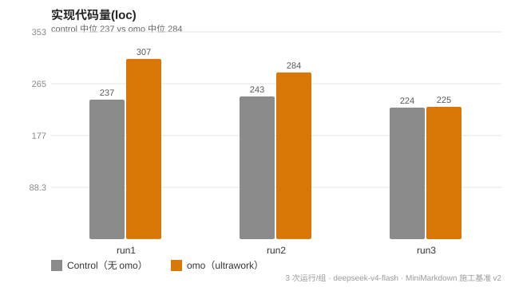
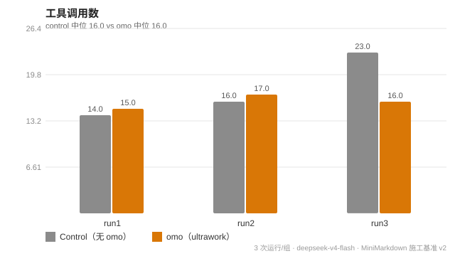
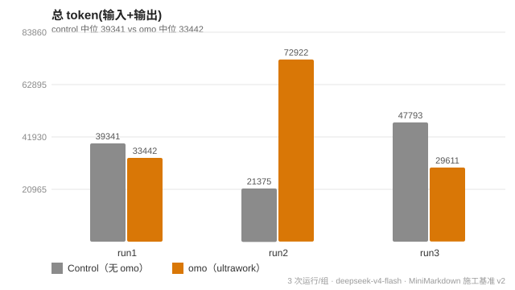
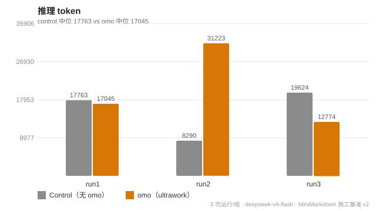

# omo-deepseek-harness Benchmark v2 — 同一软件设计方案施工对照

**日期**：2026-08-20 · **模型**：deepseek-v4-flash（deepseek-official）· **每组 3 次运行** · 见 `spec.md`（设计规格书）

> v1（简单玩具任务）成功率饱和、无法区分；v2 改为**同一份软件设计规格书 → 两组各自完整施工 → 对产出的软件用成熟基准评估**。

## 1. 实验设计

**任务**：按同一份设计规格书（`spec.md`）实现 **MiniMarkdown**——一个 Markdown→HTML 转换器（库 + CLI），含 12 类语法、5 字符 HTML 转义防 XSS、6 类边界行为、自测 ≥10、CLI 错误路径。

| 维度 | 设计 |
|---|---|
| 条件 | control（无 omo）vs omo（ultrawork 四阶段协议），同一份规格书 |
| 运行数 | 每组 3 次（`H:\Code\omo-bench-v2\{control|omo}-{1..3}\`，独立目录） |
| 产物评估 | 父代理**独立**执行：隐藏验收套件 / 覆盖率 / 结构度量 / 大输入性能（不看实现、非子代理自报） |
| 过程指标 | 从会话日志 JSONL 提取（步骤/工具调用/token/耗时，含真实 usage） |

**成熟基准映射**（arXiv 参考）：
- **SWE-bench（arXiv 2310.06770）**：隐藏独立验收套件通过率（"resolved"判定，23 用例含 4 个安全转义项）
- **HumanEval / pass@k（arXiv 2107.03374）**：规格 + 边界正确率
- **代码质量指标（ISO 25010）**：行覆盖率（node `--experimental-test-coverage`）、代码量/函数数
- **AI Agents That Matter（arXiv 2407.01502）**：成本受控——成功/成本比 + 过程效率（步骤/token/耗时/估算成本）
- **Reflexion（arXiv 2303.11366）**：自纠行为（实现中发现的 bug 与修复）

## 2. 产物质量结果（对"施工出来的软件"的独立评估）

| 运行 | 隐藏套件 (23) | 自测数 | 行覆盖率 % | 300KB 耗时 ms | 实现 loc |
|---|---|---|---|---|---|
| control-1 | 23/23 | 24 | **98.31** | 30.8 | 237 |
| control-2 | 23/23 | 21 | 92.98 | 57.0 | 243 |
| control-3 | 23/23 | 23 | 97.31 | 21.9 | 224 |
| **control 中位** | **23/23** | **23** | **97.31** | **30.8** | **237** |
| omo-1 | 23/23 | 23 | 95.42 | 33.0 | 307 |
| omo-2 | 23/23 | 23 | **81.98** | 28.2 | 284 |
| omo-3 | 23/23 | 23 | 96.88 | 75.1 | 225 |
| **omo 中位** | **23/23** | **23** | **95.42** | **33.0** | **284** |

- **功能正确性：6/6 全部通过隐藏套件（23/23）**——两组都交付了符合规格、全项安全转义（`</script>` 恒为实体）的软件；此维度无差异
- **覆盖率**：control 中位 97.31% vs omo 95.42%（+1.9pp）；omo-2 离群（81.98%——自测 23 个全过但分支覆盖不全）
- **性能**：基本持平（30.8 vs 33.0ms，+7%）；omo-3 离群（75.1ms）
- **结构**：omo 实现略大（284 vs 237 loc，+20%）；omo-1 最全（307 loc / 11 函数）

## 3. 过程效率结果（施工过程本身）

| 运行 | 步骤 | 工具调用 | 失败调用 | 输入+输出 token | 推理 token | 施工耗时 s | 估算成本 $ |
|---|---|---|---|---|---|---|---|
| control-1 | 12 | 14 | 0 | 39.3k | 17.8k | 191 | 0.060 |
| control-2 | 17 | 16 | 0 | 21.4k | 8.3k | 119 | 0.052 |
| control-3 | 22 | 23 | 0 | 47.8k | 19.6k | 220 | 0.095 |
| **control 中位** | **17** | **16** | **0** | **39.3k** | **17.8k** | **191** | **0.060** |
| omo-1 | 9 | 15 | 0 | 33.4k | 17.0k | 175 | 0.050 |
| omo-2 | 14 | 17 | 0 | 72.9k | 31.2k | 316 | 0.095 |
| omo-3 | 7 | 16 | 0 | 29.6k | 12.8k | 330 | 0.038 |
| **omo 中位** | **9** | **16** | **0** | **33.4k** | **17.0k** | **316** | **0.050** |

（成本：DeepSeek 公开参考价估算 in $0.27/M、cache $0.07/M、out $1.10/M，v4-flash 实际价未公开）

## 4. 图表

## 5. 结论（诚实报告）

1. **产物质量：两组无差异**（隐藏套件 6/6 全过，覆盖率/性能基本持平）——**规格清晰时，有无 ultrawork 对"施工出来的软件"的正确性无显著影响**；两组交付的都是达标、防 XSS 的软件。
2. **过程效率：v2 结论与 v1 反转**：
   - **步骤 omo -47%**（9 vs 17，中位）——任务复杂后，ultrawork"规划先行+验证"减少了零散返工式小步骤（omo 组一次到位，control 组边做边想步骤多）
   - **估算成本 omo -18%**（$0.050 vs $0.060）——步骤少 → 缓存重读少
   - **但耗时 omo +65%**（316 vs 191s）——每步思考更多（规划/验证阶段），输出/推理 token 中位持平（组内方差大）
3. **与 v1 的对照呼应了"收益随复杂度上升"**：v1 简单任务 omo 是纯开销（步骤更多）；v2 复杂任务 omo 转为过程效率项（步骤更少、成本略低）。这印证 v1 报告"收益面需要更难任务才能测出"的判断。
4. **自纠行为**：control-3 与 omo-2 各修了一个真实 bug（图片/链接解析、有序列表正则分组）——两组都发生了"测试驱动自纠"；omo 组的验证是协议强制的（第四阶段），control 组由"测试跑到全绿"任务要求驱动。
5. **离群与局限**：
   - omo-2：token 最高（72.9k）但覆盖率最低（81.98%）——"想得多"不等于"测得全"
   - omo-3：耗时最长（330s）但步骤最少（7）——每步深度思考
   - n=3、单任务、单模型；隐藏套件判定是规格化断言（未覆盖超出规格的设计自由度）
6. **一句话总结**：同一份软件设计，两组都能交付合格软件（产物无差异）；ultrawork 的过程价值体现为**步骤更少、成本略低、但耗时更长**——在复杂施工任务上从 v1 的"开销项"变为"效率项"，收益方向符合设计意图，幅度与显著性受样本限制。

## 6. 复现

- 规格书：`spec.md`；双条件 prompt：`prompt-control.txt` / `prompt-omo.txt`
- 原始数据：`data.json`（产物指标 + 会话指标 + 成本假设）
- 运行产物（本地证据）：`H:\Code\omo-bench-v2\{control|omo}-{1..3}\`（父代理独立重跑 hidden 套件 + 覆盖率 + 性能）
